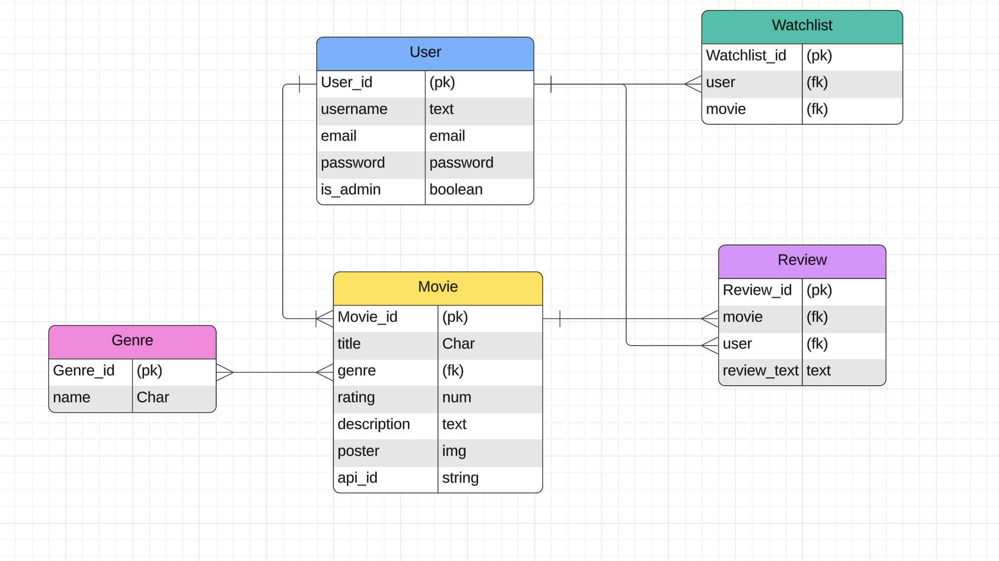
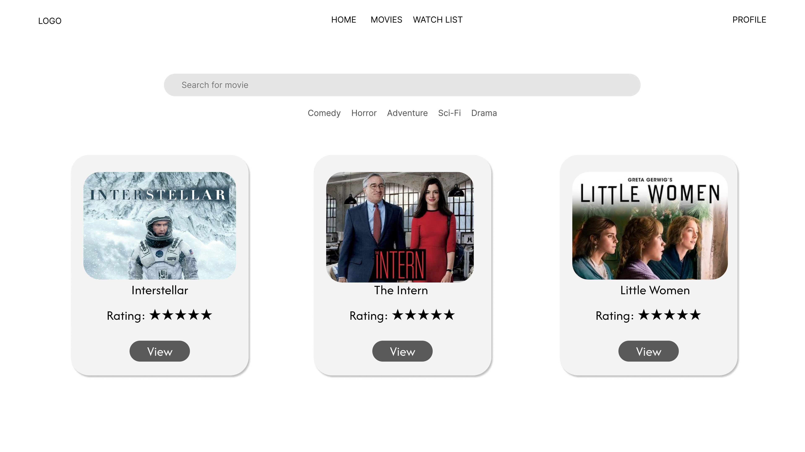
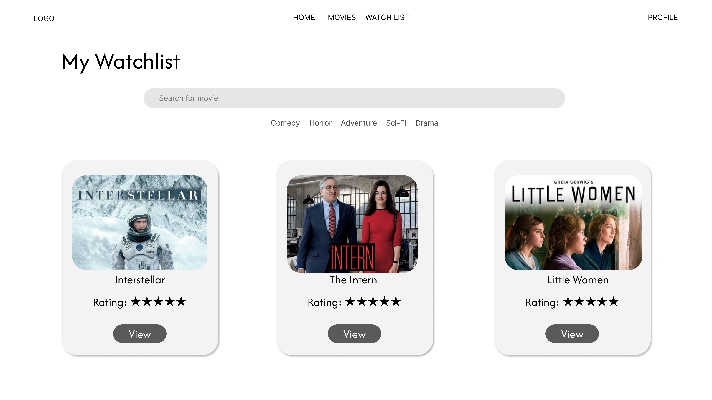
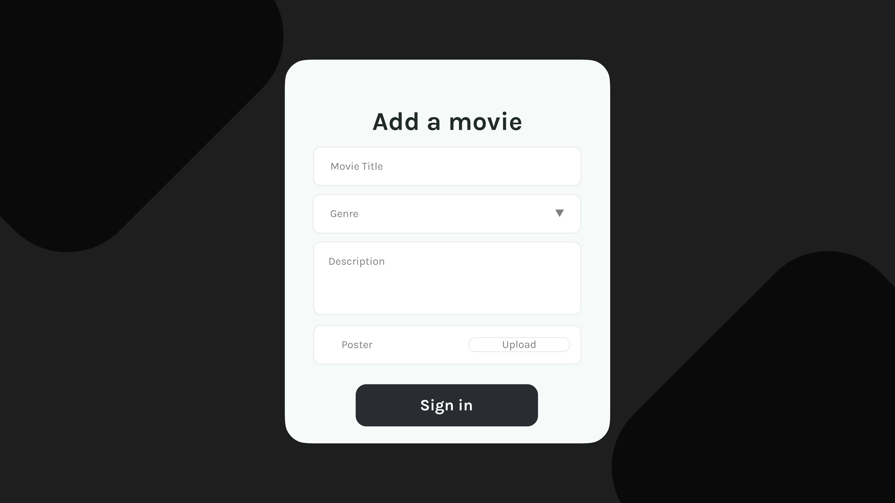

# Movie-Convo

## Project Description
**Movie-Convo** is a user-friendly website that allows movie enthusiasts to dive into the world of cinema. With a comprehensive database of movies, users can explore detailed information about their favorite films, including **synopsis**, **ratings**, **trailers**, and more. The platform also empowers users to actively engage by writing **reviews** and curating a personal **watchlist**.

## ERD

## Wire Frames

## List of Technologies Used

- Django
- Postgres
- PgAdmin

## Future Enhancments

- Stream Movies

### Additional Links

- [Project Trello Board](https://trello.com/invite/b/6786a850bfd695423220f3d6/ATTIa39a133c5eb3583cd162d0b2389bdb130565C747/movie-convo)
